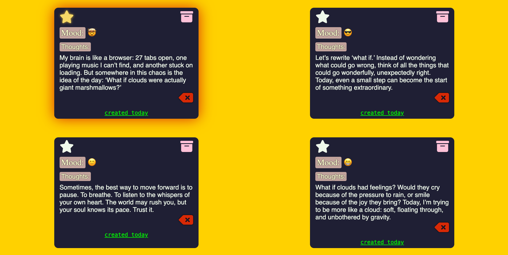
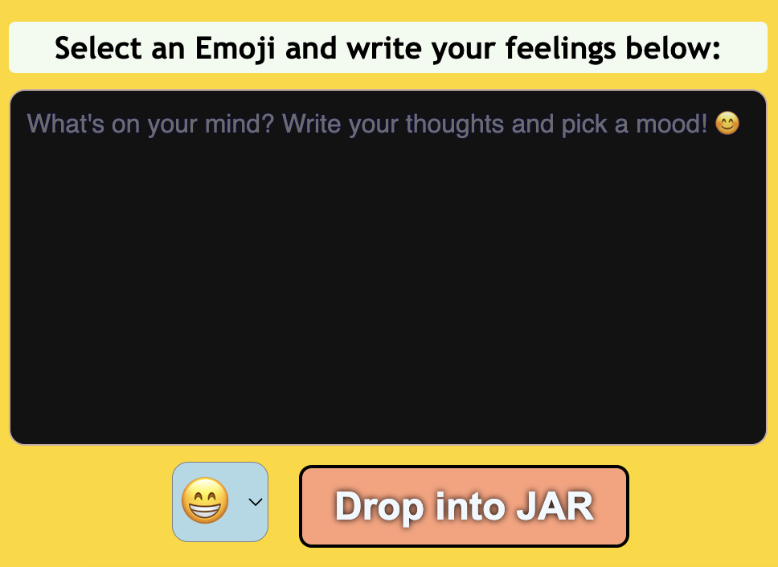

# 🌟 Mood Jar

Mood Jar is a simple, interactive web application that allows users to log their daily emotions in a visual "mood jar." Each mood entry is represented by an emoji and a brief description, creating a fun and engaging way to track your feelings over time.

---

## 📝 Features

- **Add Moods**: Select an emoji and write a brief description of your mood.  
- **Dynamic Feed**: Displays all mood entries in a feed format.  
- **Interactive Interface**: Easy-to-use and beginner-friendly design.  

---

## 🛠️ Technologies Used

- **HTML**: Structure of the website.  
- **CSS**: Styling for a clean and engaging look.  
- **JavaScript**: Handles functionality and interactivity.  

---

## 🚀 How to Use

### Enter Mood:
1. **Type your mood description** in the text input field.
2. **Select an emoji** that represents your mood.

### Save:
- Click the **"Drop into JAR" button** to add your mood to the feed and jar.

### View Moods:
1. **Mood Feed:** 
   - Check the feed to see a list of all your logged moods, displayed with their respective emojis and descriptions.

### Hover Over Emojis:
- Emojis are displayed in a line.
- **Hover over an emoji** to see a tooltip showing how many times that emoji has been used.  
  For example: Hovering over `😊` might display **"has been used 5 times"**.   

#### Manage Logged Moods:
1. **Delete:**  
   - Click the **delete icon** next to a mood entry to remove it from the feed and jar.
2. **Star to Favorite:**  
   - Click the **star icon** to mark a mood as a favorite, making it stand out in the feed.
3. **Archive:**  
   - Click the **archive icon** to reduce the opacity of a mood entry, indicating it’s archived but still visible for reference.

---

## 📂 Project Structure  
Mood Jar     
├── index.html          # Main HTML file  
├── index.css           # Styling for the website  
├── index.js           # JavaScript for interactivity  
└── README.md           # Documentation file  

---

## 📸 Screenshots

### Mood Jar and Feed  

### Adding a Mood  

---

## 🖌️ Customization

- **Modify Emoji List**: Update the `<select>` dropdown in `index.html` to add more emojis.  
- **Change Styles**: Edit `style.css` to customize the appearance of the mood jar or feed.  
- **Enhance Functionality**: Use `script.js` to add new features like date filtering or analytics.  

---

## 🌟 Future Enhancements

- Add a calendar view to track moods over time.  
- Provide insights or reports based on mood trends.  
- Allow users to edit or delete mood entries.  

---

## 🧑‍💻 Contribution

Feel free to contribute to this project by:  

1. Forking the repository.  
2. Creating a new branch for your feature or bug fix.  
3. Submitting a pull request.  

---

## 📜 License

This project is licensed under the MIT License.

---

## 💬 Contact

For any questions or feedback, please reach out to [https://github.com/Aminkhan-mid/Mood-Jar.git].

---

Happy tracking your emotions! 😊
